# Writeup: Track 3D-Objects Over Time

Please use this starter template to answer the following questions:

#### 1. Write a short recap of the four tracking steps and what you implemented there (filter, track management, association, camera fusion). Which results did you achieve? Which part of the project was most difficult for you to complete, and why?
## STEP - 1 - Compute Lidar Point-Cloud from Range Image
Range and intensity channels are extrected from lidar data, which is stored as range image in the Waymo Open Dataset. After that, floating-point data converted to an 8-bit integer value range. Finally, range and intensity image visualized with OpenCV.

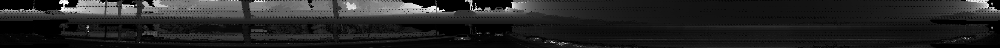

In second part of step-1, Open3D library used to display lidar point-clodu data in a 3d viewer.

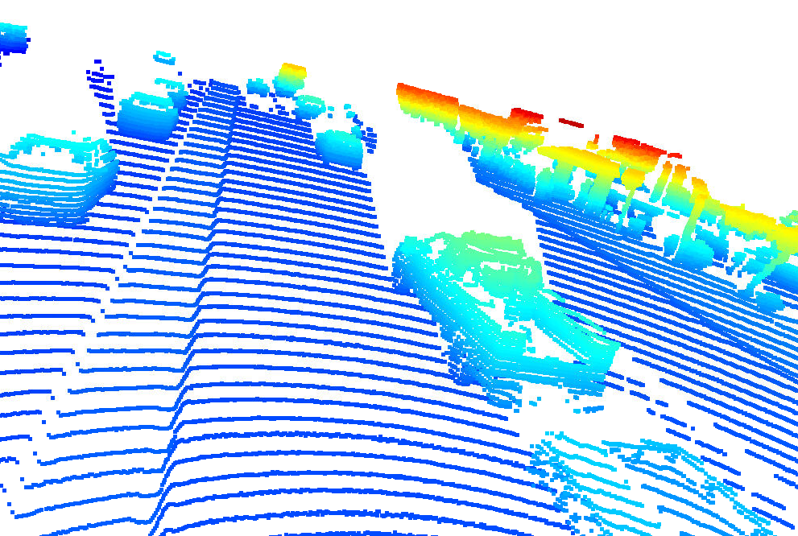
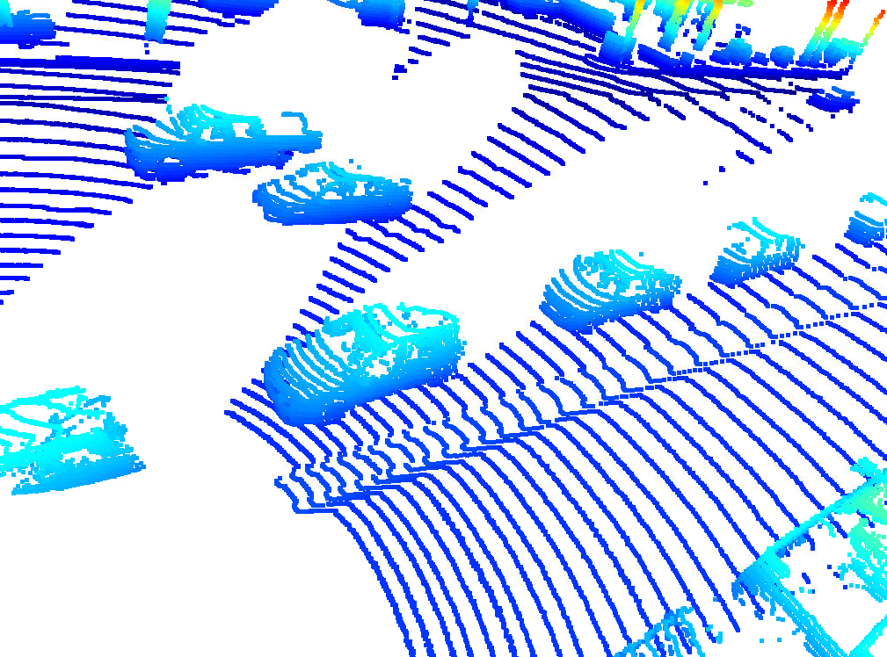
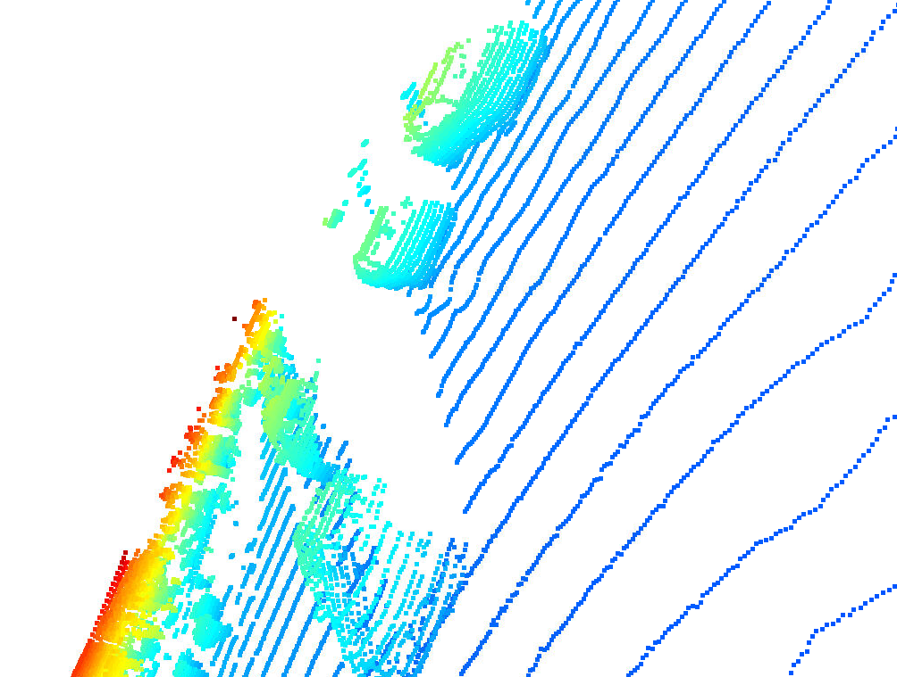
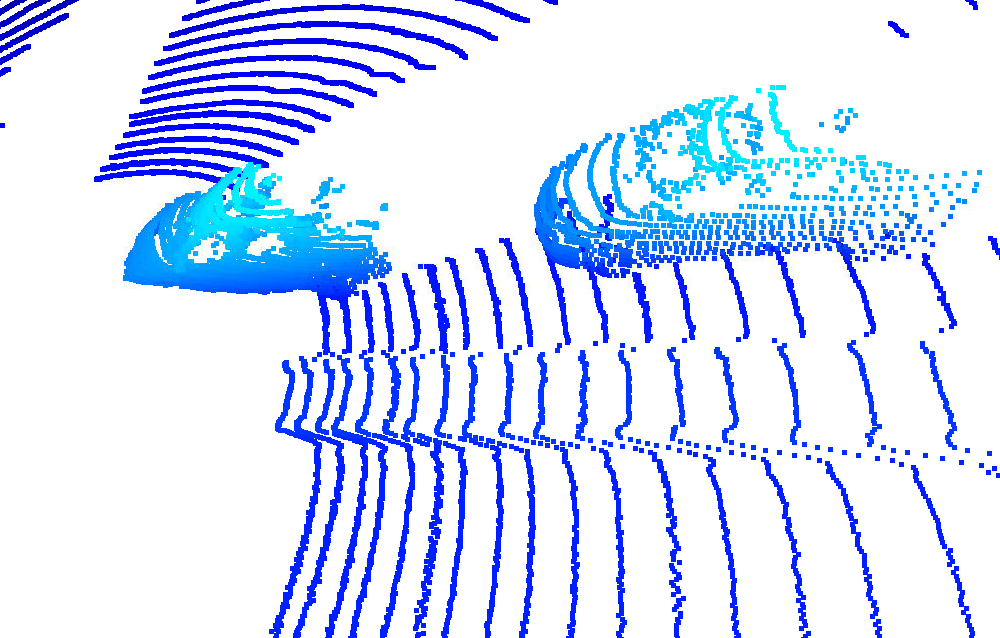
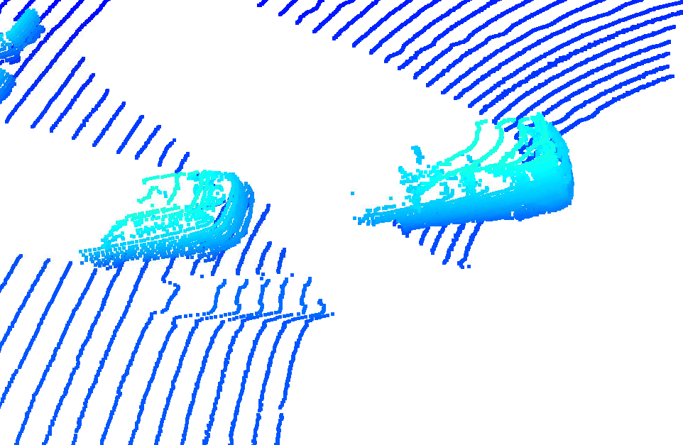
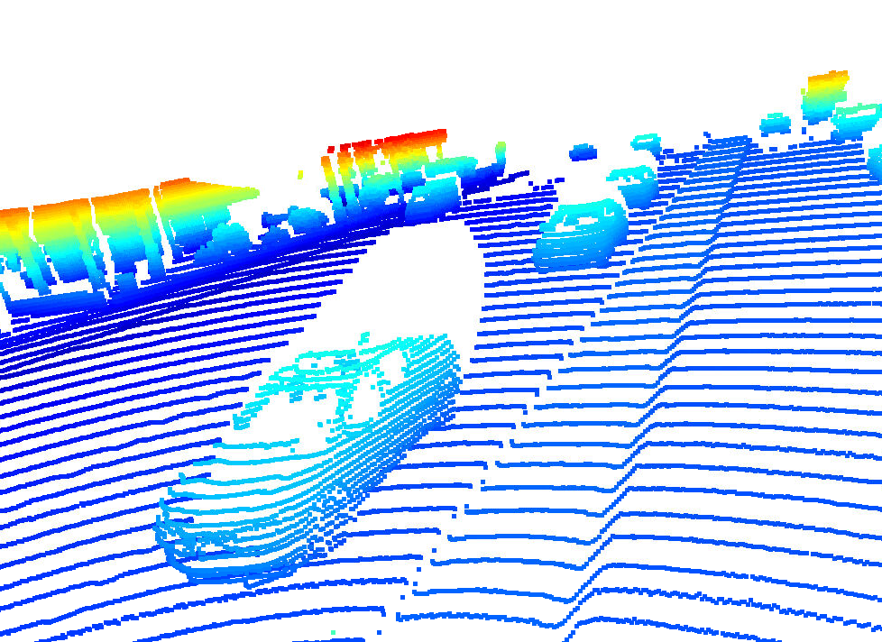
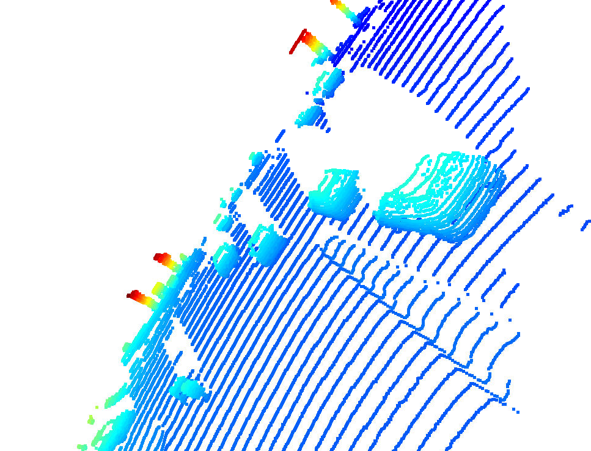
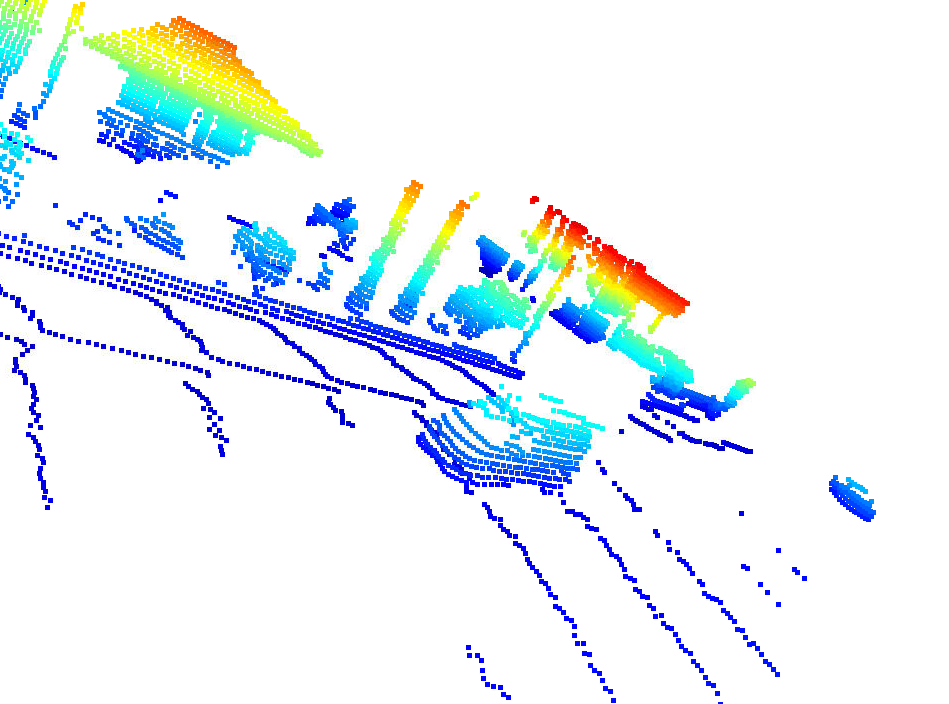
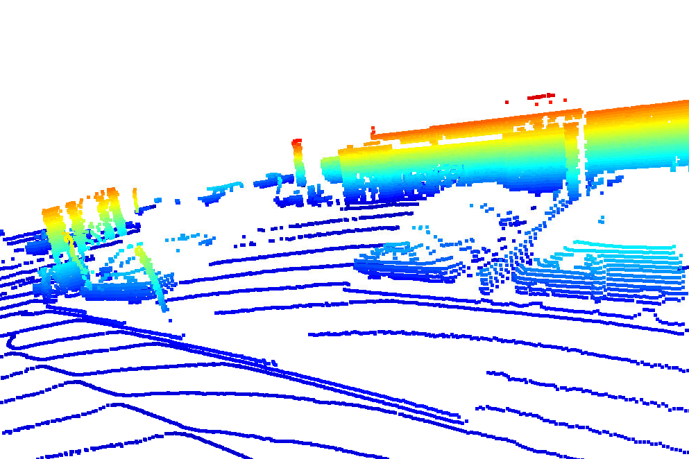
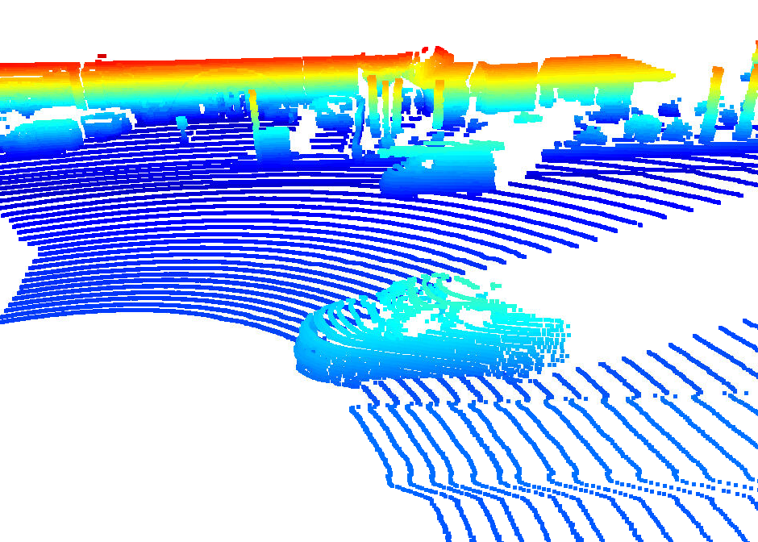

## STEP - 2 - Create Birds-Eye View from Lidar PCL
Created a birds-eye view (BEV) perspective from a lidar point-cloud. While doing this, (x,y) coordinates which is in sensor space, converted to BEV coordinate space.

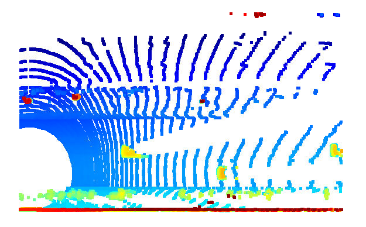

Also, "intensity" channel of the BEV map filled with data from the point-cloud. In order to do so, all points with the same (x,y)-coordinates identified within the BEV map and then assigned the intensity value of the top-most lidar point to the respective BEV pixel. After that, intensity image normalized using percentiles in order to ake sure that the influence of outlier values (very bright and very dark regions) is sufficiently mitigated and objects of interest (e.g. vehicles) are clearly separated from the background.

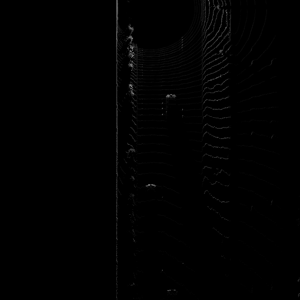

On final part of this step, "height" channel of the BEV map filled with data from the point-cloud. While doing this, point-cloud sorted and pruned, additionally, the height in each BEV map pixel is normalized by the difference between max. and min.

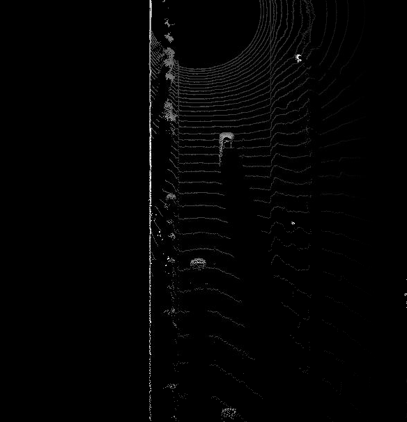

## STEP - 3 - Model-based Object Detection in BEV Image
In this step, the repo [Super Fast and Accurate 3D Object Detection based on 3D LiDAR Point Clouds](https://github.com/maudzung/SFA3D) used to extract model config parameters. With this paramters, fpn_resnet model is instantiated. After that, decoded the model output and post-processing performed. Finally, bounding boxes of detections converted using the limits in the configs structure.

As the model input is a three-channel BEV map, the detected objects will be returned with coordinates and properties in the BEV coordinate space. Thus, before the detections can move along in the processing pipeline, they need to be converted into metric coordinates in vehicle space. This task is about performing this conversion.

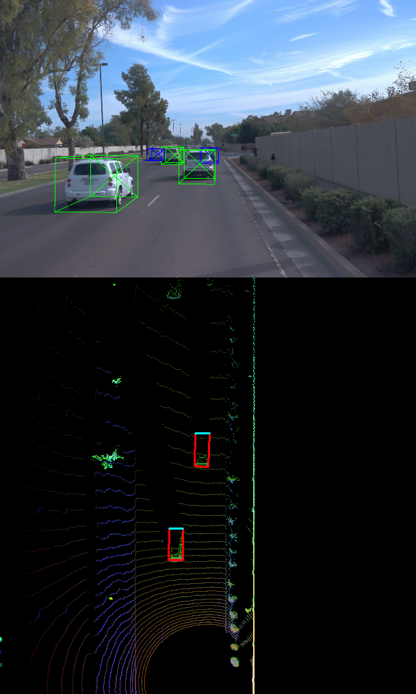

## STEP - 4 - Performance Evaluation for Object Detection

The goal of this task is to find pairings between ground-truth labels and detections, so that we can determine wether an object has been (a) missed (false negative), (b) successfully detected (true positive) or (c) has been falsely reported (false positive). Based on the labels within the Waymo Open Dataset, your task is to compute the geometrical overlap between the bounding boxes of labels and detected objects and determine the percentage of this overlap in relation to the area of the bounding boxes. A default method in the literature to arrive at this value is called intersection over union.

Based on the pairings between ground-truth labels and detected objects, the goal of this task is to determine the number of false positives and false negatives for the current frame. After all frames have been processed, an overall performance measure will be computed based on the results produced in this task.

After processing all the frames of a sequence, the performance of the object detection algorithm shall now be evaluated. To do so in a meaningful way, the two standard measures "precision" and "recall" will be used, which are based on the accumulated number of positives and negatives from all frames.

To make sure that the code produces plausible results, the flag configs_det.use_labels_as_objects set to True in a second run. The resulting performance measures for this setting should be the following:
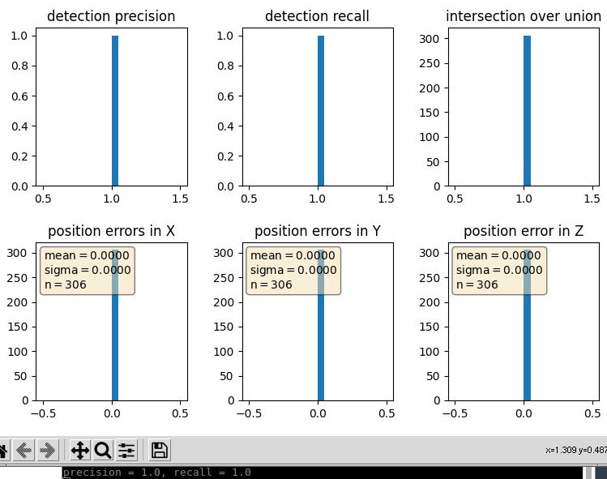

#### 2. Do you see any benefits in camera-lidar fusion compared to lidar-only tracking (in theory and in your concrete results)? 
In autonomous systems, it is certain that multiple sensors should be used to detect cars, cyclists, pedestrians robustly. Also it is certain that it will increase safety. With fusing sensor datas, it will mitigate sensor noises and detection errors. 

#### 3. Which challenges will a sensor fusion system face in real-life scenarios? Did you see any of these challenges in the project?
Extrinsics and intinsics calibraitons of sensor will highly effect the fusion results. Also finding a robust algorithm for all environments (i.e crowd places, different objects than labeled data etc.) will increase algorithm complexity.

#### 4. Can you think of ways to improve your tracking results in the future?
Dataset images should be audited and corrupted or unsuitable datas should be removed from the dataset. Also with more evaluating methods, model accuracy should be incresed. Additionally, coordinate systems conversions should be fine tuned and position errors should be decreased. 
